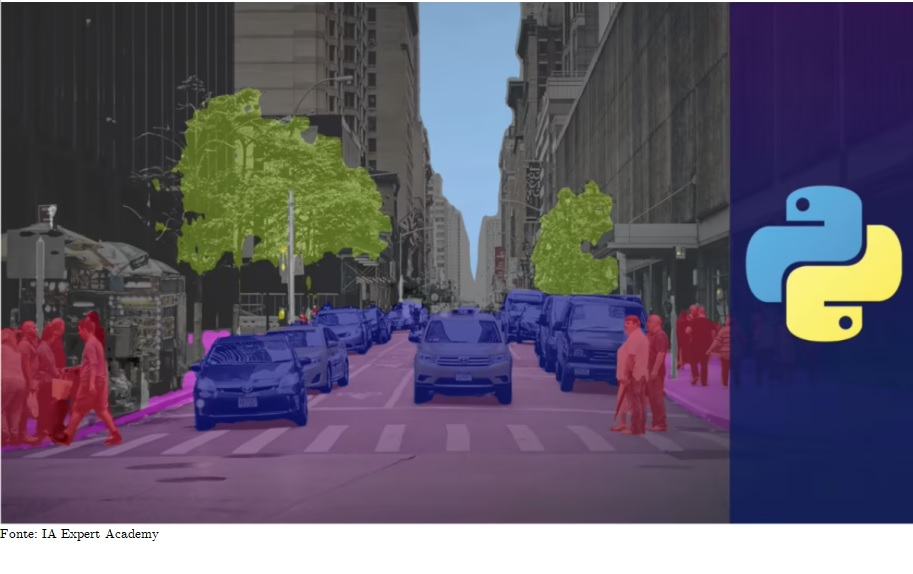

<h3 align="center">Conecte-se comigo em:</h3>

---

<h3 align="center"> 
	🚧 🚀 Em construção...🚀  🚧
</h3>

---

<h3 align="center"><b>Segmentação de Imagens com Python de A a Z</b></h3>

     

---

### Sobre o projeto:

A segmentação de imagem é um dos pontos fundamentais no ``Processamento Digital de Imagens``. Ter uma bagagem nos principais métodos de segmentação é primordial para quem deseja desenvolver projetos na área da Visão Computacional. O objetivo deste projeto é realizar a implementação de técnicas de segmentação de imagens nos mais variados campos de concentração, visando melhorar o ``hands-on`` na área, aprimorando técnicas e aplicando em casos reais do dia a dia.

O curso ``Segmentação de Imagens com Pythonde A a Z`` é oferecido pela [IA Expert Academy](https://iaexpert.academy/) e pode ser conferido no [seguinte link](https://iaexpert.academy/courses/segmentacao-imagens-python-a-z/).

### Conteúdo do curso:

O curso de ``Segmentação de Imagens com Python de A a Z`` da [IA Expert Academy](https://iaexpert.academy/) está dividido nos tópicos apresentados na tabela abaixo. 
Cada tópico terá uma pasta específica para visualização dos resultados e códigos implementados que podem ser acessados clicando em seu respectivo link.

A implementação do curso está sendo feita totalmente no ``Google Colab``, ou seja, qualquer pessoa com acesso a um computador e internet poderá analisar e até mesmo reescrever os códigos na forma que achar melhor.

| Etapas | Descrição | Link |
| --- | --- | --- |
| 1ª etapa | Segmentação com abordagens clássicas | [Parte 1](https://github.com/AlanMarquesRocha/segmentacao_imagens_pdi/blob/master/segmentacao_imagens_pt1.ipynb)
| 2ª etapa | Segmentação de instâncias com Mask R-CNN | [Em implementação](Link)
| 3ª etapa | Segmentação semântica | [Em implementação](Link)
| 4ª etapa | Segmentação panóptica | [Em implementação](Link)
